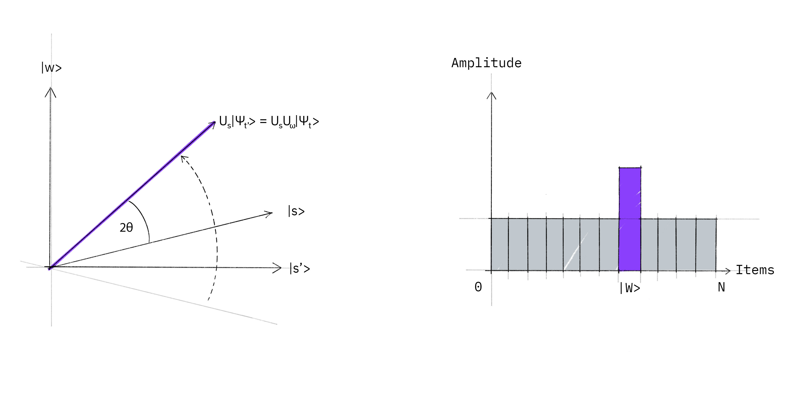

# Grover's Algo Implementaion

Grover's algo can speed up unstructured data searching.
Process involved are
Oracle  creation and Amplitude Amplification.

### Problem
Find |11> state from all 2 qubit states(|00>,|01>,|10>,|11>).

### Oracle
Oracle can be used to chek wheather a value is target value or not , but it cannot find the target value 
from range of values.

Since we are finding |11> , we used CZ gate.So sign of |11> will be revesed.

        oracle = QuantumCircuit(2,name='Oracle')
        oracle.cz(1,0)
        oracle.to_gate()

### Amplitude amplification
It will increase the probability of target state.
2S>&lt;S - I is the reflection operator.
Grover's Diffusion is reflection operator sandwitched in hadamard (H 2S>&lt;S - I H ).

There is a simple geometrical version of explanation is there . Let's go with that.
Let |w> denote winning state , |s> denote super position state.
|s'> denote state perpendicular to |w> in a way |w> component removed from |s>.

Initial state.

After Oracle treatment the amplitude of |11> flips.

After Grover's  Diffusion
The |s> formed after Oracle treatment is reflected along inital |s> , making it closer towards winning state.

Inorder to find reflection , one way of thinking is adding a negative phase π to all except |11>.

        diffusion = QuantumCircuit(2,name="Grover's diffusion")
        diffusion.h([0,1])
        diffusion.z([0,1])
        diffusion.cz(0,1)
        diffusion.to_gate()
        diffusion.h([0,1])
        diffusion.to_gate()
        diffusion.draw()

### Grover's Iter
Both Oracle and Diffusion together is groover's iter.Probabilty of winning state(|w>) will be max after √N iterations.

        grover_iter = QuantumCircuit(2,name="Grover's Iter")
        grover_iter.append(oracle,[0,1])
        grover_iter.append(diffusion,[0,1])
        grover_iter.draw()

### Implmenting
Since we used 2 qubit system. One iteration is enough.
        
        grover_circ = QuantumCircuit(2,2)
        grover_circ.h([1,0])
        grover_circ.append(grover_iter,[0,1])
        grover_circ.measure([0,1],[0,1])
        grover_circ.draw()

Result in qasm_simulator

Result in ibm_oslo -- IBM Quatum Computer

Little deveations because of quatum noise.